<h3><code>cypherlynx@github ~ $ ./contributions.sh</code></h3>

  

<h3><code>cypherlynx@github ~ $ whoami</code></h3>

## Selected projects

| Project | What it is |
|---|---|
| [ToolQuiver](https://github.com/CYPHERLYNX/toolquiver) | Windows desktop app (Electron + SQLite) that analyzes GitHub repos, websites, social posts, and APKs into a persistent, categorized library. |
| [whitespace](https://github.com/CYPHERLYNX/whitespace) | Zero-dependency Python CLI: AI-tool trend radar plus an evidence-backed novelty gate for ideas. |
| [Local-Network-Vulnerability-Sccanner](https://github.com/CYPHERLYNX/Local-Network-Vulnerability-Sccanner) | Windows network-security suite: Nmap port scanning, Scapy packet capture, AI-assisted threat reports. |
| [SOAR-EDR-Playbook](https://github.com/CYPHERLYNX/SOAR-EDR-Playbook) | Lazagne credential-access detection rule (MITRE ATT&CK) with an analyst triage playbook. |
| [ProfileHub](https://github.com/CYPHERLYNX/ProfileHub) | Flask personal-information system: profile CRUD, photo uploads, live search, CSV/PDF export. |

**Stack:** TypeScript · Electron · Python · Flask · SQLite

**Contact:** open an issue on any repo, or find me at [github.com/CYPHERLYNX](https://github.com/CYPHERLYNX).
