<!-- hero: monochrome ASCII portrait (types in) beside the extruded 3D ascii
     wordmark (wipes in left-to-right).
     portrait: python scripts/make_portrait_svg.py
     wordmark: python scripts/make_wordmark_svg.py -->

<h3><code>x0d4n@github ~ $ whoami</code></h3>

<table>
<tr>
<td valign="top"></td>
<td valign="top"></td>
</tr>
</table>

 
 

<!-- animated contribution graph: real data, cells pop in left to right
     (regenerated daily by .github/workflows/update-profile-art.yml) -->

<h3><code>x0d4n@github ~ $ ./contributions.sh</code></h3>

 
 

<h3><code>x0d4n@github ~ $ ./links.sh</code></h3>

<b>Final-year student · Software developer · Cybersecurity enthusiast</b>

 

